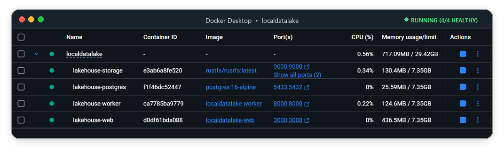

# Local Lakehouse

[](LICENSE)
[](https://nextjs.org/)
[](https://payloadcms.com/)
[](https://duckdb.org/)
[](https://fastapi.tiangolo.com/)
[](https://github.com/rustfs/rustfs)

> **Status:** Early-stage / actively developed. Core ingestion → query flow works end to end; expect rough edges. Issues and PRs welcome.

An open-source, self-hostable lakehouse data stack engineered for small teams and single-node workloads.

Turn _"wire together an object store, catalog, and query engine yourself"_ into a single `docker compose up`.

<p align="center">
  
</p>

---

## Overview

Most small teams face a dilemma when scaling analytical workloads:

- **Postgres-for-everything** starts to slow down and struggle with heavy analytical queries and large scans.
- **Enterprise cloud warehouses** (Databricks, Snowflake, BigQuery) introduce massive infrastructure bills, cold warehouse idle charges, and distributed compute operational complexity.

**Local Lakehouse** is built for data that comfortably fits on a single machine or VPS. It delivers the advantages of a modern lakehouse architecture without requiring a dedicated data engineering platform team. In practice, that means comfortably handling datasets in the tens of gigabytes to low terabytes on a single well-specced machine the range where Postgres analytical queries start to choke, but a Spark or Trino cluster is massive overkill.

### Key Pillars

- **Open by Construction**: Data is stored as Parquet files under an open table format (DuckLake) with atomic transactional commits and schema evolution.
- **Honest Single-Node Simplicity**: Powered by DuckDB for blazingly fast in-process analytical execution without the overhead of distributed Spark or Trino clusters.
- **Integrated Control Plane**: Built-in Next.js and Payload CMS application providing authentication, multi-tenant isolation, dataset exploration, job monitoring, and an interactive SQL Query Studio.
- **S3-Compatible Object Storage**: Embedded RustFS storage layer with tenant-isolated bucket prefixes (`raw/`, `tables/`, `metadata/`). RustFS and DuckDB are built as swappable adapters, today's release ships single-node DuckDB + RustFS, with other S3-compatible stores and query engines on the roadmap. You're not locked into this specific pair.
- **Deploy Anywhere**: Full Docker Compose setup ready for local development, VPS hosting, or deployment platforms like Coolify.

---

## Architecture & Components

```
┌─────────────────────────────────────────────────────────────────────────────┐
│                          Control Plane (apps/web)                           │
│     Next.js 15 • Payload CMS 3.0 • Tenant Management • Web SQL Studio       │
└───────────────────────┬─────────────────────────────┬───────────────────────┘
                        │ HTTP / Jobs                 │ SQL / DuckDB queries
                        ▼                             ▼
┌───────────────────────────────────┐    ┌────────────────────────────────────┐
│      Worker (services/worker)     │    │       DuckDB + DuckLake Catalog    │
│  FastAPI • Ingestion • PyArrow    │───►│    Transactional Table Commits     │
└─────────────────┬─────────────────┘    └─────────────────┬──────────────────┘
                  │ S3 API                                 │ S3 API / Parquet
                  ▼                                        ▼
┌─────────────────────────────────────────────────────────────────────────────┐
│                       RustFS S3-Compatible Storage                          │
│          Tenant Isolation: raw/  •  tables/  •  metadata/                   │
└─────────────────────────────────────────────────────────────────────────────┘
```

| Component             | Technology                            | Role                                                                                          |
| --------------------- | ------------------------------------- | --------------------------------------------------------------------------------------------- |
| **Control Plane**     | Next.js 15, Payload CMS 3.0, React 19 | Admin dashboard, auth, multi-tenant management, dataset browser, and interactive SQL studio.  |
| **Processing Worker** | Python 3.11+, FastAPI, PyArrow        | Asynchronous ingestion, data cleaning, validation, and table creation.                        |
| **Analytics Engine**  | DuckDB + DuckLake                     | In-process analytical query execution, open table transactional writes, and schema evolution. |
| **Object Storage**    | RustFS (S3 Compatible)                | High-performance local object storage with tenant-isolated paths and web console.             |
| **Metadata DB**       | PostgreSQL 16                         | Shared persistence for Payload CMS operational state and DuckLake catalog metadata.           |

---

## Why DuckLake (and not raw Iceberg/Delta, or a hand-rolled DuckDB+MinIO setup)

Most self-hosted lakehouse tutorials wire together DuckDB and an S3-compatible store by hand you own the catalog logic, the transaction semantics, and the schema evolution yourself. DuckLake gives you atomic commits and schema evolution as a first-class part of the table format, without needing a separate catalog service (Hive Metastore, Glue, etc.) that Iceberg and Delta typically assume.

The tradeoff: DuckLake is younger and less battle-tested than Iceberg/Delta, and its ecosystem (readers/writers outside DuckDB) is smaller. If you need Spark, Trino, or Snowflake to read the same tables, Iceberg is the safer choice today. Local Lakehouse is built for the case where DuckDB _is_ your query engine not a piece of a larger federated stack.

---

## End-to-End Workflow

1. **Tenant Provisioning**: Administrator provisions an isolated tenant organization within Payload CMS.
2. **File Ingestion**: Tenant user uploads CSV, JSON, or Parquet files into RustFS object storage under their tenant prefix (`raw/`).
3. **Pipeline Trigger**: A Payload background job dispatches the ingestion request to the FastAPI worker.
4. **Data Cleaning & Commit**: Worker processes the dataset, cleans invalid records, and commits an open table via DuckLake.
5. **Interactive Querying**: Users explore and execute ad-hoc SQL queries against their tenant tables directly in the Web SQL Studio powered by DuckDB.

---

## Quickstart

### Option 1: Docker Compose (Recommended)

Boot the entire stack (PostgreSQL, RustFS, Python Worker, and Web UI) with one command:

1. **Clone the repository**:

   ```bash
   git clone https://github.com/Teelon/Local-Lakehouse.git
   cd Local-Lakehouse
   ```

2. **Set up environment variables**:

   ```bash
   # Windows PowerShell
   if (!(Test-Path .env)) { Copy-Item .env.example .env }

   # Linux / macOS
   cp -n .env.example .env
   ```

3. **Start the containers**:

   ```bash
   docker compose up -d --build
   ```

4. **Verify container health**:
   ```bash
   docker compose ps
   ```

---

### Option 2: Standalone Local Development

For fast local iteration on the frontend or worker:

#### 1. Web Control Plane (Next.js + Payload)

```bash
cd apps/web
npm install
npm run dev
```

Access the application at [http://localhost:3000](http://localhost:3000) and the Payload Admin panel at [http://localhost:3000/admin](http://localhost:3000/admin).

#### 2. Processing Worker (FastAPI)

```bash
cd services/worker
python -m venv .venv
# Windows:
.venv\Scripts\activate
# Linux / macOS:
source .venv/bin/activate

pip install -e .
uvicorn app.main:app --host 0.0.0.0 --port 8000 --reload
```

Test the worker health endpoint:

```bash
curl http://localhost:8000/healthz
```

---

## Service Endpoints & Default Ports

| Service               | Port            | Default URL                                                | Description                                                  |
| --------------------- | --------------- | ---------------------------------------------------------- | ------------------------------------------------------------ |
| **Web Control Plane** | `3000`          | [http://localhost:3000](http://localhost:3000)             | Main application & Interactive DuckDB SQL Studio             |
| **Payload CMS Admin** | `3000`          | [http://localhost:3000/admin](http://localhost:3000/admin) | Auth, Tenant management, and Collection administration       |
| **FastAPI Worker**    | `8000`          | [http://localhost:8000](http://localhost:8000)             | Ingestion and transformation API                             |
| **RustFS Console**    | `9001`          | [http://localhost:9001](http://localhost:9001)             | Object storage web console (user: `lakehouse_storage_admin`) |
| **RustFS S3 API**     | `9000`          | [http://localhost:9000](http://localhost:9000)             | S3-compatible API endpoint                                   |
| **PostgreSQL**        | `5432` / `5433` | `localhost:5432`                                           | Shared operational database & DuckLake catalog               |

---

## Repository Structure

```
Local-Lakehouse/
├── apps/
│   └── web/                   # Next.js 15 + Payload CMS 3.0 control plane & SQL studio
│       ├── Dockerfile
│       ├── package.json
│       └── src/
├── services/
│   └── worker/                # Python + FastAPI processing & DuckLake worker
│       ├── Dockerfile
│       ├── pyproject.toml
│       └── app/
├── infrastructure/
│   ├── postgres/              # PostgreSQL initialization scripts and schemas
│   └── storage/               # Storage configurations
├── media/                     # Project screenshots and documentation assets
├── .env.example               # Template environment configuration
├── docker-compose.yml         # Full multi-container composition
├── LICENSE                    # Apache 2.0 License
└── README.md                  # Project documentation
```

---

## Teardown & Data Reset

Stop containers:

```bash
docker compose down
```

Stop containers and remove persistent data volumes (`postgres_data`, `storage_data`):

```bash
docker compose down -v
```

---

## License

This project is licensed under the **Apache License 2.0**. See the [LICENSE](LICENSE) file for complete details.
